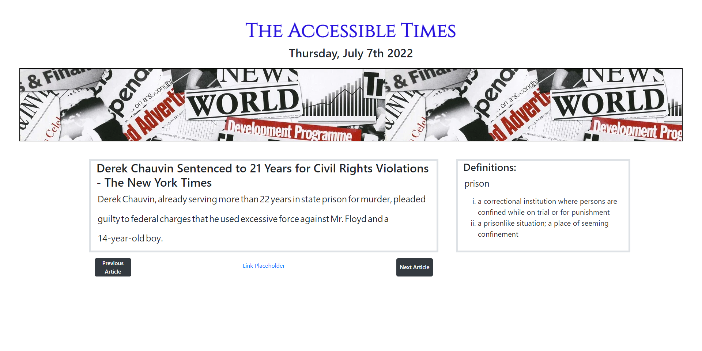

# The Accessible Times #

**Note:** This repository contains the source code for group project #1 of GA Tech's 2022 Coding Bootcamp.

## Description ##

A growing proportion of the population doesn’t keep up with the news. The reasons why are as varied as they are complex; however, a major factor is the lack of accessibility features the common news sources have. Whether it’s due to confusing language, complex vocabulary, or a lack of English fluency on the part of the reader, consuming news articles can be very difficult for some. America, and increasingly the world, is a melting pot of immigrants of all linguistic backgrounds. Our website, The Accessible Times, aims to help people not only read but truly comprehend the news through use of interactive accessibility options. Don’t know a word? Click it and you will find a list of definitions appear for that word! Future plans are already being made to expand this functionality to include the ability to obtain other information about terms such as synonyms, antonyms, and even explanations idioms.

## Technology Used ##

[MomentJS API](https://momentjs.com/)

[Google News API](https://rapidapi.com/ubillarnet/api/google-news1/)

[WordsAPI](https://rapidapi.com/dpventures/api/wordsapi/)

## Live Website ##

https://chromodyne.github.io/the_accessible_times/

## Screenshot ##

